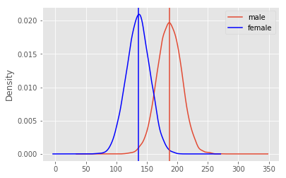
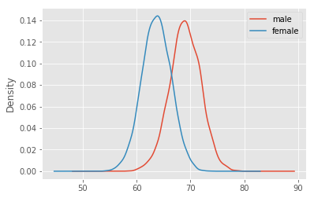

```python
import matplotlib.pyplot as plt
plt.style.use('ggplot')
import pandas as pd 
data = pd.read_csv('weight-height.csv')
data.head()
```


<div>
<style scoped>
    .dataframe tbody tr th:only-of-type {
        vertical-align: middle;
    }

    .dataframe tbody tr th {
        vertical-align: top;
    }

    .dataframe thead th {
        text-align: right;
    }
</style>
<table border="1" class="dataframe">
  <thead>
    <tr style="text-align: right;">
      <th></th>
      <th>Gender</th>
      <th>Height</th>
      <th>Weight</th>
    </tr>
  </thead>
  <tbody>
    <tr>
      <th>0</th>
      <td>Male</td>
      <td>73.847017</td>
      <td>241.893563</td>
    </tr>
    <tr>
      <th>1</th>
      <td>Male</td>
      <td>68.781904</td>
      <td>162.310473</td>
    </tr>
    <tr>
      <th>2</th>
      <td>Male</td>
      <td>74.110105</td>
      <td>212.740856</td>
    </tr>
    <tr>
      <th>3</th>
      <td>Male</td>
      <td>71.730978</td>
      <td>220.042470</td>
    </tr>
    <tr>
      <th>4</th>
      <td>Male</td>
      <td>69.881796</td>
      <td>206.349801</td>
    </tr>
  </tbody>
</table>
</div>


```python
male_df =  data.loc[data['Gender'] == 'Male']
female_df =  data.loc[data['Gender'] == 'Female']
print(male_df.Height.mean(), female_df.Height.mean())
print(male_df.Weight.mean(), female_df.Weight.mean())
```

    69.02634590621737 63.708773603424916
    187.0206206581929 135.8600930074687


```python
male_df.Weight.plot.kde(label = 'male')
female_df.Weight.plot.kde(label = 'female', color = 'b')
plt.axvline(187.02)
plt.axvline(135.86, color = 'b')

plt.legend()
```


    <matplotlib.legend.Legend at 0x1a213aa0f0>





```python
male_df.Height.plot.kde(label = 'male')
female_df.Height.plot.kde(label = 'female')
plt.legend()
```


    <matplotlib.legend.Legend at 0x1a1fd486d8>





```python
x = list(data['Height'].groupby(data['Gender']))
```


```python
female = x[0]
male = x[1]
new = pd.DataFrame([female, male])
```


```python
new.head()
```


<div>
<style scoped>
    .dataframe tbody tr th:only-of-type {
        vertical-align: middle;
    }

    .dataframe tbody tr th {
        vertical-align: top;
    }

    .dataframe thead th {
        text-align: right;
    }
</style>
<table border="1" class="dataframe">
  <thead>
    <tr style="text-align: right;">
      <th></th>
      <th>0</th>
      <th>1</th>
    </tr>
  </thead>
  <tbody>
    <tr>
      <th>0</th>
      <td>Female</td>
      <td>2      185
3      195
9      169
11     159
12...</td>
    </tr>
    <tr>
      <th>1</th>
      <td>Male</td>
      <td>0      174
1      189
4      149
5      189
6 ...</td>
    </tr>
  </tbody>
</table>
</div>


